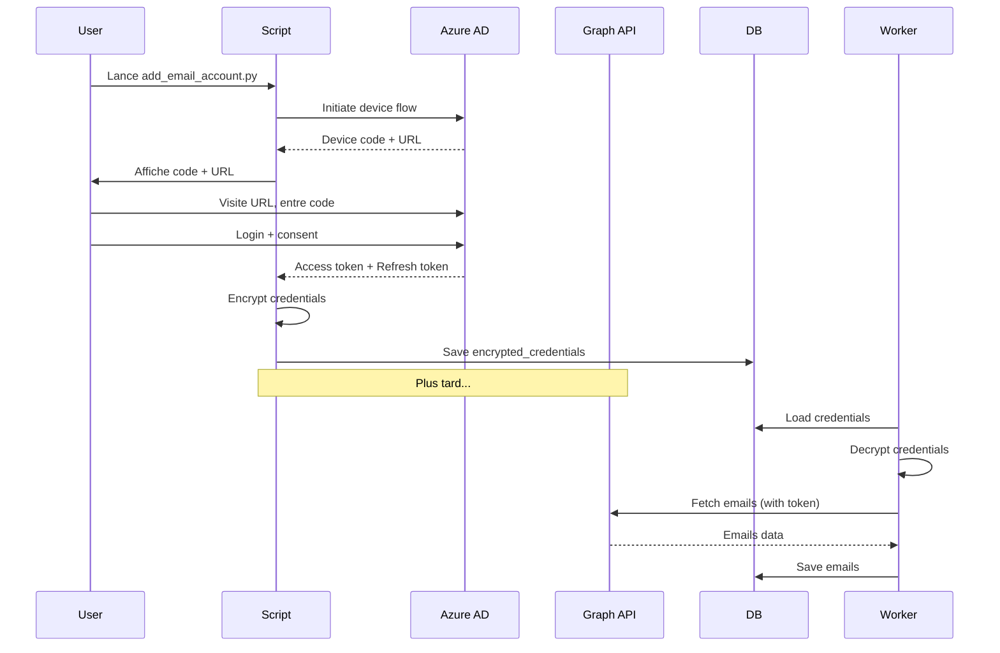

# 📘 Guide de configuration Microsoft / Outlook

> Configuration complète pour intégrer des comptes **Microsoft 365**, **Outlook.com**, et **Office 365** avec Email Agent AI via **Microsoft Graph API** et **OAuth2**.

---

## 🎯 Vue d'ensemble

### Pourquoi Microsoft Graph API?

| Aspect | Graph API (OAuth2) | IMAP |
|--------|-------------------|------|
| **Sécurité** | ✅ Tokens révocables, pas de mot de passe | ⚠️ Mot de passe stocké |
| **Permissions** | ✅ Granulaires (Read, Modify) | ❌ Accès complet |
| **Performance** | ✅ API REST moderne, batch possible | ⚠️ Protocole legacy |
| **Fonctionnalités** | ✅ Métadonnées riches, attachments | ⚠️ Basique |
| **Limites** | ✅ Plus élevées (Graph API) | ⚠️ Throttling IMAP |

### Types de comptes supportés

- ✅ **Microsoft 365** (Entreprise/Education)
- ✅ **Outlook.com** (Personnel)
- ✅ **Office 365** (Business)
- ✅ **Exchange Online**

---

## 🔧 Configuration Azure AD (Prérequis)

### Étape 1: Créer une application Azure AD

1. **Accéder au portail Azure**
   ```
   https://portal.azure.com → Azure Active Directory → App registrations
   ```

2. **Créer une nouvelle application**
   - Cliquez sur "New registration"
   - **Name**: `Email Agent AI` (ou votre nom)
   - **Supported account types**:
     - Choisir "Accounts in any organizational directory and personal Microsoft accounts"
   - **Redirect URI**: (laisser vide pour device code flow)
   - Cliquez sur "Register"

3. **Noter le Client ID**
   ```
   Overview → Application (client) ID

   Exemple: 12345678-1234-1234-1234-123456789abc
   ```

4. **Noter le Tenant ID** (optionnel)
   ```
   Overview → Directory (tenant) ID

   Pour multi-tenant: utiliser "common"
   ```

### Étape 2: Configurer les permissions

1. **Accéder aux API permissions**
   ```
   API permissions → Add a permission → Microsoft Graph → Delegated permissions
   ```

2. **Ajouter les permissions suivantes**:
   ```
   ☑️ Mail.Read         - Lire les emails
   ☑️ Mail.ReadWrite    - Lire et modifier (déplacer, supprimer)
   ☑️ offline_access    - Refresh token (IMPORTANT!)
   ```

3. **Cliquer sur "Add permissions"**

4. **Grant admin consent** (Si possible)
   - Si vous êtes admin: cliquer sur "Grant admin consent for [Organization]"
   - Sinon: les utilisateurs devront consentir individuellement

### Étape 3: Client Secret (Optionnel)

Pour une **Confidential Client Application** (recommandé en production):

1. **Créer un secret**
   ```
   Certificates & secrets → New client secret
   ```

2. **Description**: `Email Agent Secret`

3. **Expiration**: Choisir selon votre politique (6 mois, 12 mois, 24 mois)

4. **Noter le secret** (⚠️ une seule fois!)
   ```
   Value: xxxxxxxxxxxxxxxxxxxxxxxxxxxxx
   ```

   > ⚠️ **Important**: Sauvegardez le secret immédiatement, il ne sera plus visible après!

### Étape 4: Configuration Email Agent AI

Ajouter dans votre fichier `.env`:

```bash
# Microsoft OAuth2
MICROSOFT_CLIENT_ID=12345678-1234-1234-1234-123456789abc
MICROSOFT_CLIENT_SECRET=xxxxxxxxxxxxxxxxxxxxx  # Optionnel
MICROSOFT_TENANT_ID=common  # ou votre tenant ID spécifique
```

---

## 🚀 Méthodes d'ajout de compte

### Méthode 1: Script interactif (Recommandé)

```bash
# Via Docker
docker-compose exec api python scripts/add_email_account.py

# Ou localement
python scripts/add_email_account.py
```

**Étapes**:
1. Choisir "2. Outlook/Microsoft"
2. Choisir "1. OAuth2"
3. Suivre le **Device Code Flow**:
   - Un code sera affiché (ex: `A1B2C3D4`)
   - Aller sur https://microsoft.com/devicelogin
   - Entrer le code
   - Se connecter avec votre compte Microsoft
   - Accepter les permissions
4. Le script sauvegarde automatiquement les credentials

### Méthode 2: Script de test OAuth2

Pour tester uniquement le flow OAuth2:

```bash
python scripts/test_microsoft_connector.py oauth
```

Cela va:
- Lancer le device code flow
- Sauvegarder les credentials dans `scripts/microsoft_credentials.json`
- Vous permettre de tester avant d'ajouter à la DB

### Méthode 3: IMAP (Fallback)

Si OAuth2 n'est pas disponible:

```bash
python scripts/add_email_account.py
```

1. Choisir "2. Outlook/Microsoft"
2. Choisir "2. IMAP direct"
3. **Prérequis**:
   - IMAP doit être activé dans les paramètres Outlook
   - URL: https://outlook.live.com/mail/0/options/mail/accounts
   - Activer: "Let devices and apps use POP" (inclut IMAP)

---

## 🧪 Test de la configuration

### Test 1: Test du connecteur

```bash
python scripts/test_microsoft_connector.py
```

**Doit afficher**:
```
🧪 Test MicrosoftConnector - Microsoft Graph API
📧 Email: your-email@outlook.com
🔑 Client ID: 12345678...
🔌 Test de connexion...
✅ Connexion réussie!
📬 Récupération des 10 derniers emails...
✅ 10 emails récupérés
```

### Test 2: Test du refresh token

Le script teste automatiquement le refresh. Vérifiez:
```
🔄 Vérification du refresh des credentials...
✅ Credentials disponibles
```

Si le token était expiré:
```
🔄 Token a été refresh, sauvegarde des nouveaux credentials...
✅ Nouveaux credentials sauvegardés
```

### Test 3: Synchronisation complète

```bash
# Ajouter le compte
docker-compose exec api python scripts/add_email_account.py

# Forcer une sync manuelle
docker-compose exec worker celery -A worker.celery_app call \
  worker.tasks.email_sync.sync_account --args='[ACCOUNT_ID]'

# Vérifier les logs
docker-compose logs -f worker | grep -i sync
```

**Logs attendus**:
```
[INFO] Syncing account 1
[INFO] Found 25 messages
[INFO] Successfully parsed 25 emails
[INFO] Account 1 sync completed. Saved 25 new emails.
```

---

## 🔐 Sécurité et bonnes pratiques

### 1. Stockage sécurisé des credentials

Les credentials OAuth2 sont **chiffrés** en base de données avec **Fernet (AES 128-bit)**:

```python
# shared/security.py
from cryptography.fernet import Fernet

# Encryption automatique
encrypted = encrypt_credentials({
    "token": "ya29.xxx",
    "refresh_token": "1//xxx",
    "client_id": "xxx",
    "client_secret": "xxx",  # Optionnel
    "tenant_id": "common",
    "scopes": [...],
    "expiry": "2025-01-21T12:00:00"
})

# Stocké dans: email_accounts.encrypted_credentials
```

### 2. Refresh automatique des tokens

Le `MicrosoftConnector` refresh automatiquement les tokens expirés:

```python
# Avant chaque opération
if self._is_token_expired():
    self._refresh_access_token()  # Utilise le refresh_token

# Sauvegarde automatique en DB après sync
asyncio.run(_update_credentials_if_refreshed(account_id, connector))
```

### 3. Gestion des erreurs

```python
# worker/tasks/email_sync.py
try:
    connector = _get_connector(account)
    emails = connector.fetch_emails()
except Exception as e:
    logger.error(f"Sync failed: {e}")
    asyncio.run(_update_account_error(account_id, str(e)))
    # Last error visible dans l'API
```

### 4. Révocation des accès

**Pour révoquer l'accès**:
1. Aller sur https://account.microsoft.com/privacy/app-permissions
2. Trouver "Email Agent AI"
3. Cliquer sur "Remove"

> Le connecteur recevra une erreur 401 et marquera le compte comme inactif.

---

## 🏗️ Architecture technique

### Flow OAuth2 - Device Code



### Composants

1. **MicrosoftOAuth2Manager** (`shared/oauth2_manager.py`)
   - Gère le flow OAuth2 (device code)
   - Utilise `msal` (Microsoft Authentication Library)
   - Méthodes:
     - `interactive_auth_flow()`: Device code flow
     - `refresh_access_token()`: Token refresh

2. **MicrosoftConnector** (`shared/integrations/microsoft.py`)
   - Implémente `BaseEmailConnector`
   - Utilise Microsoft Graph API v1.0
   - Refresh automatique des tokens
   - Méthodes principales:
     - `connect()`: Établir connexion + test
     - `fetch_emails()`: Récupérer emails
     - `move_email()`: Déplacer email
     - `delete_email()`: Supprimer email

3. **Celery Worker** (`worker/tasks/email_sync.py`)
   - Factory pattern: `_get_connector(account)`
   - Auto-détection du type (IMAP vs OAuth2)
   - Sauvegarde automatique des tokens refresh

---

## 📊 Format des credentials

### Structure en base de données

```json
{
  "token": "EwBYA8l6BAAURSN/...",
  "refresh_token": "0.AXEA...",
  "client_id": "12345678-1234-1234-1234-123456789abc",
  "client_secret": "xxxxx",
  "tenant_id": "common",
  "scopes": [
    "https://graph.microsoft.com/Mail.Read",
    "https://graph.microsoft.com/Mail.ReadWrite"
  ],
  "expiry": "2025-01-21T12:00:00"
}
```

Stocké chiffré dans `email_accounts.encrypted_credentials`.

---

## 🐛 Dépannage

### Erreur: "AADSTS50076: User is required to use multi-factor authentication"

**Solution**: Compléter le flow OAuth2 avec MFA activé. Le device code flow supporte MFA nativement.

### Erreur: "Token refresh failed"

**Causes possibles**:
- Refresh token expiré (>90 jours sans utilisation)
- Application Azure AD supprimée
- Permissions révoquées par l'utilisateur

**Solution**: Ré-authentifier via `add_email_account.py`

### Erreur: "IMAP must be enabled"

Si vous utilisez IMAP (fallback):
1. Aller sur https://outlook.live.com/mail/0/options/mail/accounts
2. Activer "Let devices and apps use POP"
3. Réessayer

### Erreur: "Invalid client_id"

**Solution**: Vérifier `MICROSOFT_CLIENT_ID` dans `.env` correspond à Azure AD

### Logs utiles

```bash
# Voir tous les logs de sync
docker-compose logs -f worker | grep -i microsoft

# Voir les erreurs spécifiques
docker-compose logs worker | grep ERROR

# Tester la connexion Graph API
curl -H "Authorization: Bearer $TOKEN" \
  https://graph.microsoft.com/v1.0/me
```

---

## 📚 Ressources

### Documentation officielle

- **Microsoft Graph API**: https://docs.microsoft.com/en-us/graph/
- **Mail API Reference**: https://docs.microsoft.com/en-us/graph/api/resources/mail-api-overview
- **Device Code Flow**: https://docs.microsoft.com/en-us/azure/active-directory/develop/v2-oauth2-device-code
- **MSAL Python**: https://msal-python.readthedocs.io/

### Limites Microsoft Graph

| Ressource | Limite |
|-----------|--------|
| Requests/app/tenant | 10 000 / 10 min |
| Requests/mailbox | 1 000 / min |
| Message size | 150 MB |
| Batch requests | 20 requests / batch |

### Codes d'erreur courants

| Code | Signification | Action |
|------|---------------|--------|
| 401 | Token invalide/expiré | Refresh token |
| 403 | Permissions insuffisantes | Vérifier scopes Azure AD |
| 429 | Rate limit | Backoff exponentiel |
| 503 | Service temporairement indisponible | Retry après délai |

---

## 🎯 Checklist de mise en production

- [ ] Application Azure AD créée
- [ ] Permissions Mail.Read + Mail.ReadWrite + offline_access
- [ ] Client ID et Secret (optionnel) dans `.env`
- [ ] Test `scripts/test_microsoft_connector.py` réussi
- [ ] Compte ajouté via `add_email_account.py`
- [ ] Synchronisation automatique fonctionne
- [ ] Logs sans erreur
- [ ] Backup de la `ENCRYPTION_KEY` (`.env`)
- [ ] Documentation du process OAuth2 pour les utilisateurs

---

**✅ Configuration terminée! Votre compte Microsoft est prêt à être synchronisé.**
